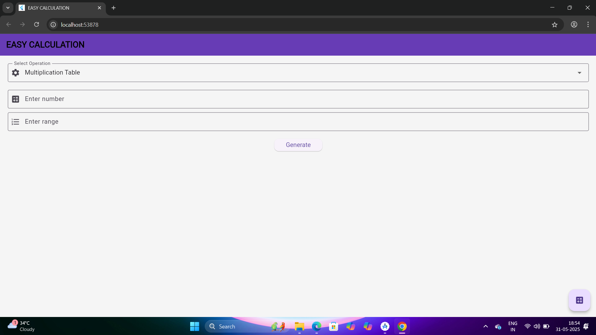
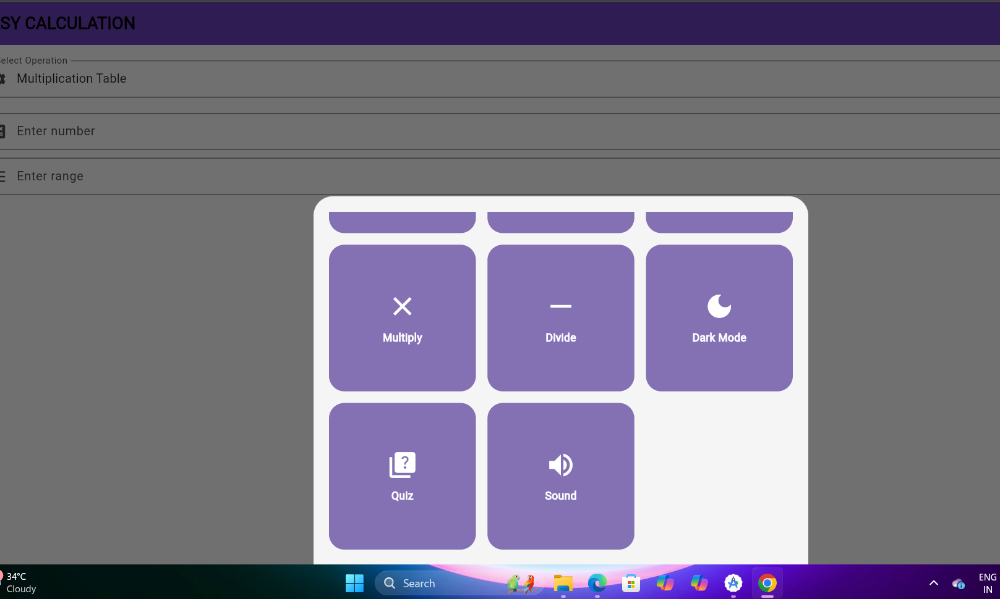
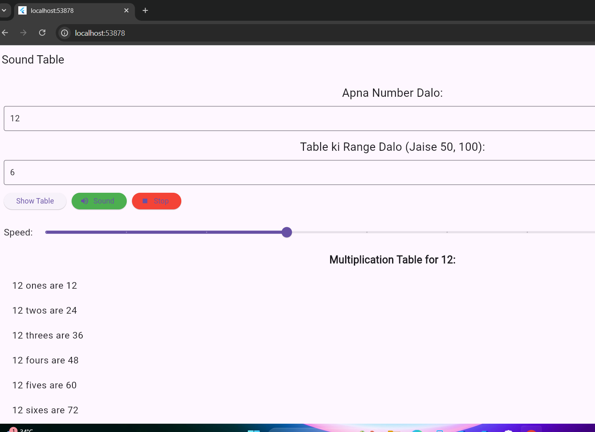

# 🧮 Easy-Calculation App (Flutter + Web)

An interactive Flutter Web App for performing basic and advanced math operations like Square, Factorial, Fibonacci, Armstrong, and more. Also includes Dark Mode for better UI experience.

 <!-- Replace with your actual image file name -->
---

## 🚀 Features
 

 
- 🔢 Square of a number  
- ✳️ Factorial calculation  
- 🔁 Fibonacci series generator  
- 🔍 Armstrong number checker  
- 🔁 Palindrome number checker  
- ➕➖ Multiplication & Division  
- 🌙 Dark mode toggle  

---

## 📲 How to Use

1. Launch the app.
2. Tap the calculator icon.
3. Select the operation you want.
4. Enter number(s).
5. Instantly get the result on screen, with sound.

---

## 📦 Deployment

This project is deployed using GitHub Pages:  
🔗 **[Live Demo](https://your-username.github.io/your-repo/)**  
<!-- Replace with your actual link -->

---

## 🛠️ Tech Stack

- **Flutter** (Mobile + Web)
- **Dart**
- **flutter_tts** (Text-to-Speech)
- **Material UI**
- **Android Studio** / **VS Code**

---

## 🙌 Made With Love By

**Priyanshu Kumar**  
💼 Flutter & Full Stack Developer  
📧 priyanshukumar23565@gmail.com  
🌐 [LinkedIn](https://linkedin.com/in/priyanshu) | [GitHub](https://github.com/Priyanshu)

